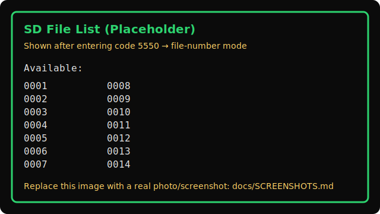

# PWDongle

Secure ESP32-S3 hardware password manager with TFT display, PIN authentication, USB HID typing, CDC configuration, and BLE smartphone control (including phone-to-PC keystroke relay).

## Features

- **Default BLE Boot** - 3-second countdown auto-boots to BLE mode for smartphone connectivity
- **4-Digit PIN Authentication** - Hardware button entry with masked digits for security
- **Password Storage** - Store up to 10 device/password pairs in non-volatile memory
- **USB HID Keyboard Mode** - Types passwords directly to connected PC
- **USB CDC Serial Mode** - Configure passwords via serial commands from PC
- **BLE UART Mode** - Control from smartphone using Nordic UART Service
- **Dual-Mode Keystroke Relay** - Send keystrokes from phone → ESP32 → PC via USB HID
- **3.3" TFT Display** - Visual UI for PIN entry and menu navigation
- **Persistent Configuration** - Login codes and passwords survive reboots
 - **SD Text Typing** - Type text files from microSD by code + file number

## Hardware

- **Board**: ESP32-S3-DevKitM-1 or ESP32-S3-LCD-1.47
- **Display**: ST7789 TFT (172x320, SPI)
- **Button**: Boot button (GPIO 0) for input
- **USB**: Dual-mode HID + CDC support

### Pin Configuration (ESP32-S3-LCD-1.47)
```
Display:
- MOSI: GPIO 45
- SCLK: GPIO 40
- CS:   GPIO 42
- DC:   GPIO 41
- BL:   GPIO 46
- RST:  Not connected

Button:
- GPIO 0 (Boot button)
```

## Build & Upload

### Prerequisites
- [PlatformIO](https://platformio.org/) installed
- ESP32-S3 board connected via USB

### Commands
```bash
# Build firmware
platformio run

# Upload to device
platformio run --target upload

# Monitor serial output
platformio device monitor --baud 115200
```

## Usage

### Boot Behavior

On power-up, the device displays a **3-second countdown** and automatically boots to BLE mode for smartphone connectivity:

- **Default**: Let countdown complete → BLE mode starts
- **Override**: Press BOOT button during countdown → PIN entry screen appears

#### Why BLE is Default?
BLE mode provides smartphone control with keystroke relay, making it the most versatile mode for everyday use. PIN entry mode is still instantly accessible via button press.

### Access Codes

| Code | Function |
|------|----------|
| `1122` | Normal access (default login) |
| `7273` | Reboot to CDC mode |
| `0000` | Force BLE mode on next boot (also auto-boots by default) |
| `5550` | SD Text File Typing mode (file-number screen; see "SD Text File Typing") |

Tip: Entering code `5550` shows a two-column list of up to 15 `.txt` files (numerically sorted) for quick selection.

### Normal Mode (Password Menu)
1. Power on device
2. **Press BOOT button during countdown** to access PIN entry
3. Enter login code `1122` using boot button
   - Short press: increment digit (0-9)
   - Long press (>600ms): confirm digit
4. Select password from menu
5. Hold button to type password via USB HID

### CDC Mode (USB Serial Configuration)
1. Enter code `7273` at boot
2. Connect serial terminal at 115200 baud
3. Available commands:
   - `HELP` - Show command list
   - `ABOUT` - Firmware info
   - `PWUPDATE` - Update passwords (requires auth)
   - `RETRIEVEPW` - Get stored passwords (requires auth)
   - `CHANGELOGIN` - Change 4-digit login code

Example:
```
> PWUPDATE
< OK: Enter the login code to authorize PW update
> 1122
< OK: Authorized. Please send NAME,DATA
> Gmail,mypass123,Github,token456
< OK: Passwords updated
```

### BLE Mode (Smartphone Control)
1. **Default**: Let 3-second countdown complete (or enter code `0000` for explicit boot)
2. Device shows "BLE ACTIVE" and advertises as "PWDongle"
3. Connect from smartphone using BLE UART terminal app:
   - Android: "Serial Bluetooth Terminal" or "nRF Connect"
   - iOS: "LightBlue" or "nRF Connect"
4. Available commands (same as CDC mode, plus):
   - `TYPE:text` - Type text on connected PC
   - `KEY:enter` - Send special key (enter, tab, backspace, etc.)
   - `KEY:ctrl+c` - Send key combination

Example keystroke relay:
```
> TYPE:username
< OK: Typed to PC
> KEY:tab
< OK: Key sent to PC
> TYPE:password
< OK: Typed to PC
> KEY:enter
< OK: Key sent to PC
```

Tip: SD Text Typing
- To type text files from microSD without BLE, enter boot code `5550` at startup. You'll see a two-column list of up to 15 `.txt` files (e.g., `0001.txt`). Enter the 4-digit number to type that file over USB HID. See “SD Text File Typing” below for details.

### SD Text File Typing

Type the contents of text files stored on the microSD card via USB HID. Files support **macros** for delays, special keys, and more.

- File format: place files in SD root named `NNNN.txt` (4 digits), e.g., `0001.txt`
- Activation code: enter boot code `5550` to enter file-number mode
- Screen UI: shows a two-column list of up to 15 available `.txt` files (basenames only), sorted numerically
- Selecting file: enter the 4-digit number (e.g., `0001`) and hold to confirm; device types the file contents verbatim
- Line endings: raw typing preserves CR (`\r`) and LF (`\n`) characters
- Repeat: remains in file-number mode for subsequent files; repeat as needed

Screenshot (placeholder):


#### Macro Syntax

Embed control tokens directly in text files using `{{COMMAND[:ARGS]}}` format. Normal text is typed as-is; only tokens are interpreted.

**Core Macros:**
- `{{DELAY:ms}}` – Pause for specified milliseconds (0–5000 ms clamped). Example: `{{DELAY:500}}`
- `{{SPEED:ms}}` – Set per-character typing delay (0–200 ms clamped). Example: `{{SPEED:10}}`
- `{{KEY:name}}` – Send a special key or key combination. Examples: `{{KEY:enter}}`, `{{KEY:tab}}`, `{{KEY:ctrl+s}}`
- `{{TEXT:...}}` – Type literal text (useful for embedding braces). Example: `{{TEXT:Hello {world}}}`

**Escaping:**
- `\{{` – Literal `{{`
- `\}}` – Literal `}}`

**Example File Content:**
```
Hello {{DELAY:500}}world!{{KEY:enter}}
{{SPEED:10}}Slower typing...{{KEY:ctrl+s}}{{DELAY:300}}{{KEY:enter}}
```

#### Macro Quick Reference

| Token | Syntax | Description | Example |
|---|---|---|---|
| Delay | `{{DELAY:ms}}` | Pause for `ms` milliseconds (0–5000 clamp) | `{{DELAY:500}}` |
| Speed | `{{SPEED:ms}}` | Per-character delay while typing (0–200 clamp) | `{{SPEED:10}}` |
| Text | `{{TEXT:...}}` | Type literal text, useful for braces | `{{TEXT:Hello {world}}}` |
| Key | `{{KEY:name}}` | Special keys | `{{KEY:enter}}`, `{{KEY:tab}}` |
| Key Combo | `{{KEY:mods+key}}` | Multiple modifiers + key | `{{KEY:ctrl+shift+esc}}`, `{{KEY:win+r}}` |
| Mouse Move | `{{MOUSE:MOVE dx dy}}` | Relative cursor movement | `{{MOUSE:MOVE 100 -50}}` |
| Mouse Click | `{{MOUSE:CLICK left|right|middle}}` | Mouse button click | `{{MOUSE:CLICK right}}` |
| Mouse Scroll | `{{MOUSE:SCROLL n}}` | Scroll `n` steps (+up / -down) | `{{MOUSE:SCROLL -3}}` |
| Gamepad Button | `{{GAMEPAD:PRESS/RELEASE btn}}` | A,B,X,Y, LB/RB, LT/RT, SELECT/BACK, START, HOME/MODE, LS/RS | `{{GAMEPAD:PRESS a}}` |
| Gamepad DPad | `{{GAMEPAD:DPAD dir}}` | `up,down,left,right,center` (+ diagonals) | `{{GAMEPAD:DPAD upright}}` |
| Gamepad Sticks | `{{GAMEPAD:LS x y}}`, `{{GAMEPAD:RS z rz}}` | Analog values in [-127,127] | `{{GAMEPAD:LS 50 -20}}` |
| Gamepad Triggers | `{{GAMEPAD:LT v}}`, `{{GAMEPAD:RT v}}` | Analog values in [-127,127] | `{{GAMEPAD:RT 80}}` |
| Audio Volume | `{{AUDIO:VOLUP[:n]}}`, `{{AUDIO:VOLDOWN[:n]}}` | Adjust volume by `n` steps | `{{AUDIO:VOLUP:3}}` |
| Audio Control | `{{AUDIO:MUTE}}`, `{{AUDIO:PLAY}}`, `{{AUDIO:STOP}}`, `{{AUDIO:NEXT}}`, `{{AUDIO:PREV}}` | Media control | `{{AUDIO:MUTE}}` |
| Escaping | `\{{`, `\}}` | Type literal braces | `\{{TEXT\}}` |

#### Supported Keys

**Basic Navigation:**
- `up`, `down`, `left`, `right`
- `home`, `end`, `pageup`, `pagedown`

**Editing:**
- `enter` / `return`, `backspace`, `delete`, `tab`, `escape` / `esc`, `insert` / `ins`

**Function Keys:**
- `f1` through `f12`

**Lock Keys:**
- `capslock` / `caps`, `numlock` / `num`, `scrolllock` / `scroll`

**Print/Pause:**
- `printscreen` / `print`, `pause` / `break`

**Numpad (Keypad):**
- `kp0` through `kp9` (or `numpad0` through `numpad9`)
- `kp_add` / `numpad_add`, `kp_subtract` / `numpad_subtract`
- `kp_multiply` / `numpad_multiply`, `kp_divide` / `numpad_divide`
- `kp_decimal` / `numpad_decimal` / `kp_dot`, `kp_enter` / `numpad_enter`

**GUI/Windows Keys:**
- `win` / `windows`, `rwin` / `rwindows`
- `menu` / `app` (Application/Context menu key)

**Modifier Keys (Left):**
- `ctrl`, `alt`, `shift`
- Combos: `ctrl+X`, `alt+X`, `shift+X` (where X is any character)

**Modifier Keys (Right):**
- `rctrl` / `rcontrol`, `ralt` / `raltgr`, `rshift`
- Combos: `rctrl+X`, `ralt+X`, `rshift+X`
- GUI combos: `win+X`, `rwin+X`

**Media Keys** (if supported by your system):
- `play` / `playpause`, `stop`, `next` / `nexttrack`, `prev` / `prevtrack`
- `volup` / `volumeup`, `voldown` / `volumedown`, `mute` / `volumemute`

**Common Examples:**
- `{{KEY:win+e}}` – Open Windows Explorer
- `{{KEY:ctrl+alt+delete}}` – Open Task Manager (Windows)
- `{{KEY:f5}}` – Refresh page/app
- `{{DELAY:1000}}` – Wait 1 second
- `{{SPEED:50}}` – Slow down typing (50ms per character)

#### Mouse Macros (Phase 2)

Control the mouse cursor and perform mouse actions embedded in text files.

**Mouse Commands:**
- `{{MOUSE:MOVE dx dy}}` – Move mouse cursor by `dx` and `dy` pixels (relative movement). Positive dx = right, negative dx = left; positive dy = down, negative dy = up. Example: `{{MOUSE:MOVE 100 50}}`
- `{{MOUSE:CLICK button}}` – Click a mouse button (`left`, `right`, or `middle`). Example: `{{MOUSE:CLICK left}}`
- `{{MOUSE:SCROLL n}}` – Scroll by `n` clicks. Positive n = scroll up, negative n = scroll down. Example: `{{MOUSE:SCROLL 3}}`

**Example File Content with Mouse:**
```
Testing mouse control{{DELAY:500}}{{MOUSE:MOVE 100 0}}{{KEY:enter}}
{{MOUSE:CLICK left}}{{DELAY:300}}{{MOUSE:SCROLL 5}}
Right-click menu:{{MOUSE:CLICK right}}
```

**Notes:**
- Mouse commands are ignored in BLE mode; they only work when typing via USB HID
- Relative movements are in pixels and depend on cursor speed settings in your OS
- Scrolling typically applies to the focused window

#### Gamepad Macros

Control a USB HID Gamepad mapped to standard Linux-style button names.

**Buttons:**
- `{{GAMEPAD:PRESS a}}`, `{{GAMEPAD:RELEASE a}}` – also supports aliases: `b,x,y,lb,rb,lt,rt,select/back,start,home/mode,ls,rs`

**D-Pad (Hat):**
- `{{GAMEPAD:DPAD up}}`, `down`, `left`, `right`, `center`
- Diagonals: `upright`, `upleft`, `downright`, `downleft`

**Analog Sticks:**
- `{{GAMEPAD:LS x y}}` – left stick; `x` and `y` in [-127,127]
- `{{GAMEPAD:RS z rz}}` – right stick; `z` and `rz` in [-127,127]

**Triggers:**
- `{{GAMEPAD:LT v}}`, `{{GAMEPAD:RT v}}` – values `v` in [-127,127]

**Example:**
```
{{GAMEPAD:PRESS a}}{{DELAY:200}}{{GAMEPAD:RELEASE a}}
{{GAMEPAD:DPAD right}}{{DELAY:100}}{{GAMEPAD:DPAD center}}
{{GAMEPAD:LS 50 -20}}{{DELAY:200}}{{GAMEPAD:RS -30 10}}
{{GAMEPAD:LT 80}}{{DELAY:100}}{{GAMEPAD:RT 60}}
```

#### Audio Macros

Control media playback and volume using HID media keys.

**Commands:**
- `{{AUDIO:VOLUP[:n]}}` – increase volume `n` steps (default 1)
- `{{AUDIO:VOLDOWN[:n]}}` – decrease volume `n` steps (default 1)
- `{{AUDIO:MUTE}}` – toggle mute
- `{{AUDIO:PLAY}}` / `{{AUDIO:STOP}}` – play/pause or stop
- `{{AUDIO:NEXT}}` / `{{AUDIO:PREV}}` – next/previous track

Note: Some hosts may not support all media keys; unsupported keys are safely ignored.

**Example:**
```
{{AUDIO:VOLUP:3}}{{DELAY:300}}{{AUDIO:MUTE}}{{DELAY:500}}{{AUDIO:PLAY}}{{DELAY:1000}}{{AUDIO:NEXT}}
```

#### Advanced Key Combos

Use multiple modifiers with a named key or a single character.

**Syntax:**
- `{{KEY:ctrl+shift+alt+f5}}`, `{{KEY:win+r}}`, `{{KEY:rctrl+shift+tab}}`

**Examples:**
- `{{KEY:win+r}}{{TEXT:cmd}}{{KEY:enter}}` – Run dialog and open Command Prompt
- `{{KEY:ctrl+shift+esc}}` – Open Task Manager (Windows)

### Samples

Example macro files are available in `samples/`:

- `0092.txt` – Audio control demo (volume, mute, play, next)
- `0093.txt` – Gamepad demo (buttons, DPAD, sticks, triggers)
- `0094.txt` – Advanced key combos (Win+R, Ctrl+Shift+Esc)

To run a sample:
- Copy the files to the SD card root
- Enter file-number mode with code `5550`
- Type the 4-digit file number (e.g., `0092`) and hold to start

### Supported Keys (Legacy Reference)

## Project Structure

```
PWDongle/
├── include/
│   ├── bluetooth.h      # BLE UART + keystroke relay
│   ├── display.h        # TFT UI functions
│   ├── input.h          # Button handling & PIN entry
│   ├── security.h       # PIN validation & persistence
│   ├── storage.h        # NVS password storage
│   └── usb.h            # USB HID/CDC + command processing
├── src/
│   ├── bluetooth.cpp    # BLE implementation
│   ├── display.cpp      # TFT rendering
│   ├── input.cpp        # Button state machine
│   ├── main.cpp         # Setup & main loop
│   ├── security.cpp     # Access codes
│   ├── storage.cpp      # NVS operations
│   └── usb.cpp          # USB modes + serial commands
├── lib/
│   └── TFT_eSPI/
│       └── User_Setup.h # Display driver config
├── boards/
│   └── esp32-s3-lcd-1.47.json  # Custom board definition
├── platformio.ini       # PlatformIO configuration
└── BLE_USAGE.md        # Detailed BLE guide
```

## Technical Details

### Storage (NVS)
- **Namespace "devstore"**: Up to 10 device/password pairs
- **Namespace "CDC"**: CDC boot flag
- **Namespace "BLE"**: BLE boot flag
- **Namespace "SEC"**: Persisted login code

### BLE Service
- **Service UUID**: `6E400001-B5A3-F393-E0A9-E50E24DCCA9E` (Nordic UART)
- **RX Characteristic**: `6E400002-B5A3-F393-E0A9-E50E24DCCA9E` (Write)
- **TX Characteristic**: `6E400003-B5A3-F393-E0A9-E50E24DCCA9E` (Notify)

### Dependencies
- `bodmer/TFT_eSPI@^2.5.43`
- `ESP32 BLE Arduino@2.0.0` (included in esp32 framework)
- Arduino framework for ESP32-S3

## Security Notes

- Default login code `1122` should be changed via `CHANGELOGIN` command
- PIN entry digits masked after acceptance (show as `*`)
- Passwords stored in plain text in NVS (device-local only)
- No encryption over BLE UART (consider security implications)

## Troubleshooting

**BLE device not appearing in scan:**
- Ensure code `0000` was entered
- Check phone's Location permission (required for BLE on Android)
- Try moving phone closer to device
- Use "nRF Connect" app for most reliable scanning

**TYPE/KEY commands not working:**
- Verify device shows "BLE ACTIVE" screen after entering `0000`
- Ensure PC recognizes device as USB keyboard
- Check serial monitor for debug output

**SD files not appearing in list:**
- Ensure the SD card is inserted and formatted (FAT32 recommended)
- Use 4-digit filenames with `.txt` extension in the SD root (e.g., `0001.txt`)
- Up to 15 files are listed; additional files won’t appear but can still be typed by number if present

**Passwords not persisting:**
- Use `ABOUT` command to verify persistence status
- Check NVS has not been erased (re-flash with `--erase-all` if needed)

## License

This project is open source. See repository for details.

## Contributing

Contributions welcome! Please open issues or pull requests on GitHub.
