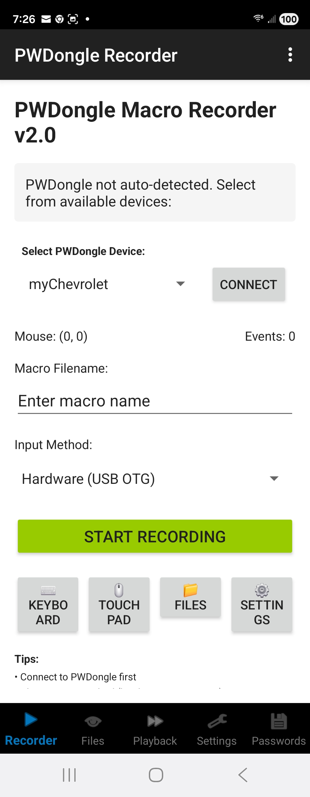
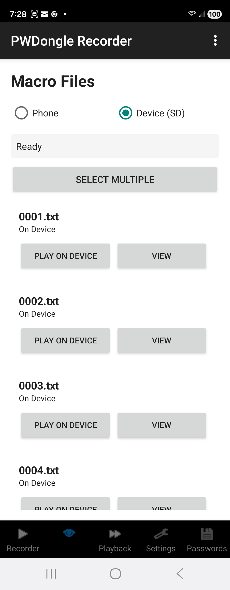
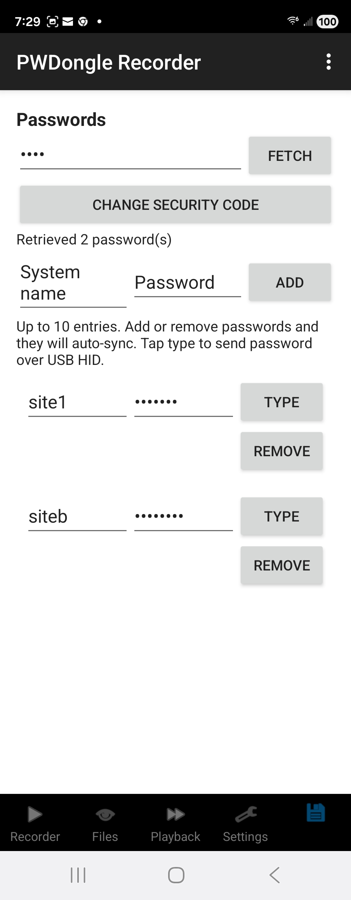

# PWDongle Android Macro Recorder

Android app for recording keyboard and mouse input via on‑screen controls or USB OTG devices and transmitting to PWDongle via Bluetooth.

## Features

- **USB OTG Input Capture**: Connects to USB keyboard and mouse via OTG adapter
- **Bluetooth LE**: Transmits commands to PWDongle (Nordic UART Service)
- **Real-time Recording**: Captures keystrokes, mouse movements, clicks with accurate timing
- **Position Tracking**: Records absolute mouse positions and movements
- **Macro Generation**: Creates PWDongle-compatible macro files with delays
 - **On-Screen Controls**: Open keyboard and touchpad directly from the Recorder screen

## Screenshots





## Requirements

- Android 6.0+ (API 23+)
- Bluetooth LE support
- USB OTG adapter
- USB keyboard and/or mouse

## Setup

### Android Studio Project

1. Open Android Studio
2. Create new project: "PWDongle Recorder"
3. Select "Empty Activity"
4. Language: Kotlin
5. Minimum SDK: API 23 (Android 6.0)

### Permissions Required

Add to `AndroidManifest.xml`:

```xml
<uses-permission android:name="android.permission.BLUETOOTH" />
<uses-permission android:name="android.permission.BLUETOOTH_ADMIN" />
<uses-permission android:name="android.permission.BLUETOOTH_SCAN" />
<uses-permission android:name="android.permission.BLUETOOTH_CONNECT" />
<uses-permission android:name="android.permission.ACCESS_FINE_LOCATION" />
<uses-permission android:name="android.permission.USB_ACCESSORY" />

<uses-feature android:name="android.hardware.bluetooth_le" android:required="true"/>
<uses-feature android:name="android.hardware.usb.host" />
```

### Dependencies

Add to `build.gradle`:

```gradle
dependencies {
    implementation 'androidx.core:core-ktx:1.12.0'
    implementation 'androidx.appcompat:appcompat:1.6.1'
    implementation 'com.google.android.material:material:1.11.0'
    implementation 'androidx.constraintlayout:constraintlayout:2.1.4'
    
    // Bluetooth LE
    implementation 'no.nordicsemi.android:ble:2.6.1'
    
    // Coroutines
    implementation 'org.jetbrains.kotlinx:kotlinx-coroutines-android:1.7.3'
}
```

## Usage

1. Launch PWDongle Recorder app
2. Grant Bluetooth permissions
3. Connect to "PWDongle" over BLE
4. In Recorder screen, enter a filename
5. Tap "Start Recording" and use on‑screen keyboard/touchpad or USB OTG inputs
6. Tap "Stop Recording" to finalize the macro on device SD

## Architecture

- `MainActivity.kt` - UI and permission handling
- `BLEManager.kt` - Bluetooth LE connection and Nordic UART communication
- `InputCaptureService.kt` - USB OTG input event capture
- `MacroRecorder.kt` - Recording state machine and timing logic
- `MouseTracker.kt` - Absolute position tracking

## File Structure

See individual source files for implementation details.

## Build Instructions

```bash
# Build APK
./gradlew assembleDebug

# Install to device
adb install app/build/outputs/apk/debug/app-debug.apk
```

## Testing

1. Connect PWDongle to PC via USB
2. Launch BLE terminal app on Android
3. Connect to "PWDongle"
4. Record a short macro (`Start Recording` → type/click → `Stop Recording`)
5. Verify macro file created on device SD card via device file browser (Boot Menu → Storage/Macro)

## License

Same as PWDongle project
